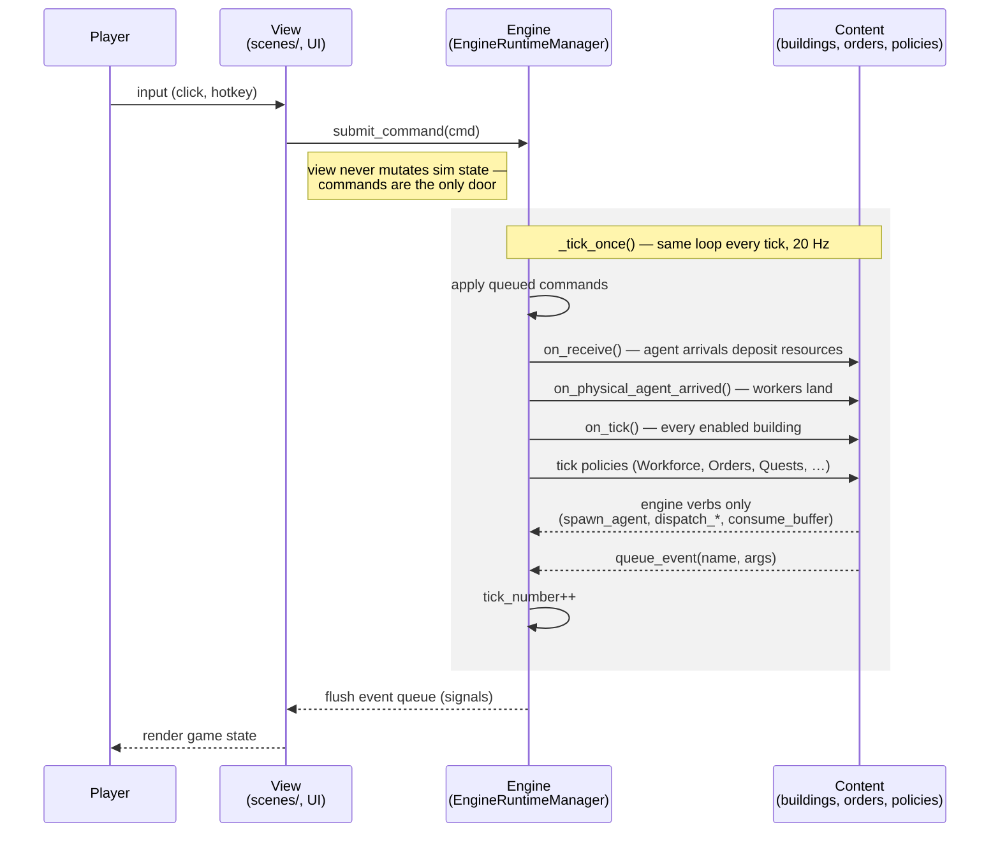
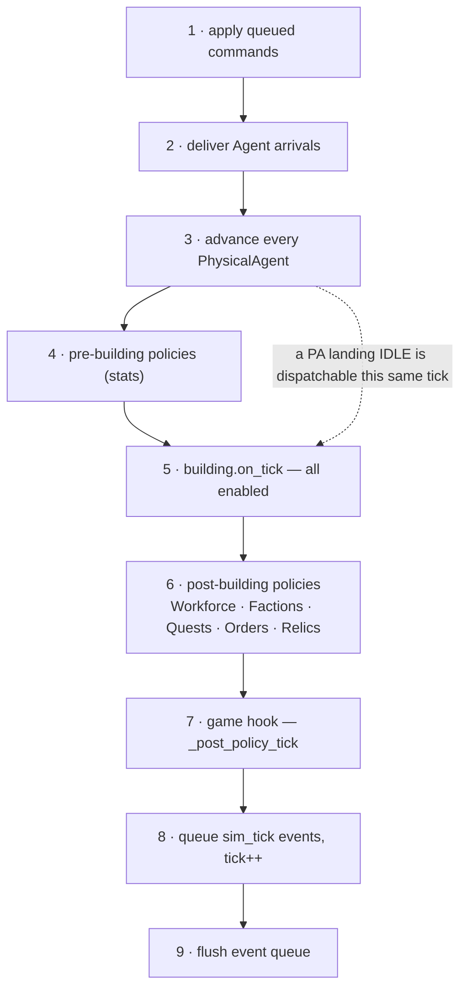

<figure style="display: flex; flex-wrap: wrap; gap: 16px; margin: 0;">
  
    <video autoplay loop muted playsinline poster="/blog/images/post2_engine.png" style="width: 100%; height: auto;">
      <source src="/blog/images/post2_engine.mp4" type="video/mp4">
    </video>
    <figcaption>What the engine sees.</figcaption>
  
  
    <video autoplay loop muted playsinline poster="/blog/images/post2_player.png" style="width: 100%; height: auto;">
      <source src="/blog/images/post2_player.mp4" type="video/mp4">
    </video>
    <figcaption>What the player sees.</figcaption>
  
</figure>

In [part 1](/blog/making-simulation-game-part-1-the-engine/) I said everything is agents moving resources between buildings.

This post is what happens when you take that literally: **the engine that runs my game does not know what beer is**. It routes agents and balances books. Every noun lives somewhere else.

---

## The Layers

The game consists of three layers: View, Engine, and Content.

1. The player only interacts with the view.
2. The engine knows nothing about the content. All it knows is **agents moving resources between buildings**.
3. Content scripts decide what kind of game this is. It just happens to be a medieval brewery game.

---

## The Simulation Tick

The engine runs at 20 Hz, framerate-independent.

Each tick, it runs one deterministic iteration.

---

## Verbs in, Events out

The player never interacts with the engine directly. They always send **commands** through the view to the engine.

The view has one API for mutating the engine: `submit_command`. Every building placement, road, and demolition is a command.

The mutation results come back as events from the engine.

---

## Intentionally non-DRY

Besides some common helpers, every content-side scene is an isolated scene tree in its own directory.

A registry automatically discovers content from directory structure conventions.

Therefore, when I'm wearing the content designer hat, I can focus on the building, the resource, or the event I want to tweak without caring about the overall system.

---

## Brews & Kings

This engine powers **Brews & Kings**, a roguelike medieval city builder where your whole city feeds one sprawling brewing operation — and kings rise or fall on the strength of your beer. Wishlist it on Steam to follow along.

<iframe src="https://store.steampowered.com/widget/4845040/" frameborder="0" width="646" height="190"></iframe>
