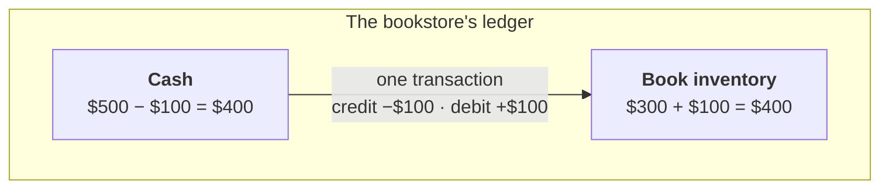
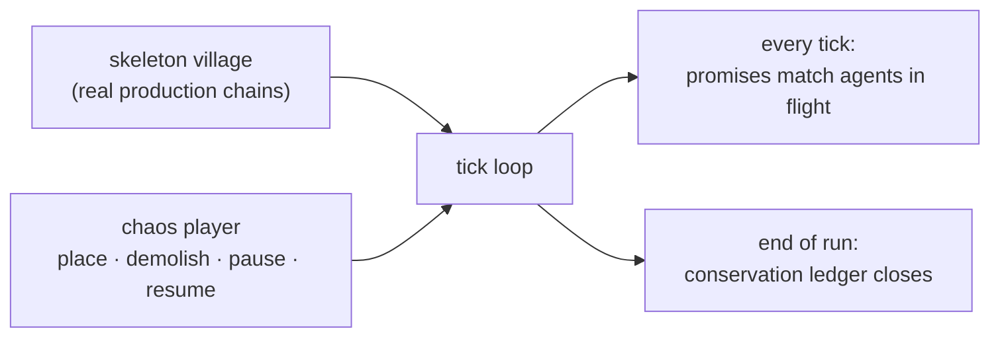

In an early build of Brews & Kings, demolishing a house while its worker was out on a delivery deleted the worker. The game didn't crash. It kept running with one less worker, and nothing reported the loss.

Resource bugs in a builder sim are hard to find because nothing crashes. A playtester tells you the brewery feels slow. There is no stack trace for that.

Every resource mutation, such as:

- spawning and draining resources,
- building buffers and agents in flight,
- every transmute, arrival, refund, and demolition,

...is a chance for the books to drift.

This is how I hardened the engine to avoid such errors.

---

## The Engine is a Long-Term Investment

In [part 2](/blog/making-simulation-game-part-2-architecture/) we split the system into views, contents, and engine. Since only the engine can mutate resources, we can focus our effort on the engine side and build lots of tooling for it.

That's another benefit of the split: **the engine rarely changes**, and every investment in it pays off long term.

---

## Double-entry bookkeeping in one minute

Accountants solved this in the 1400s.

The rule: **value is never created or destroyed. It only moves between accounts.** So every transaction is written down twice: once in the account the value leaves, once in the account it enters. The two entries cancel out.

Say a bookstore buys $100 of books from a supplier. One transaction, two entries:

Before: `$500` + `$300` = `$800`. After: `$400` + `$400` = `$800`. The total never changes. Money just moved.

In my engine, the accounts are:

- every building's buffer,
- every agent in flight (a courier carrying grain is an account: value in transit),
- and two derived columns per building, `reserved` and `pending`, for deliveries that haven't landed yet.

At any tick, `reserved` and `pending` must match the agents in flight exactly, and the totals must balance. That's the invariant my engine checks every tick.

---

## The fuzzer

In [part 2](/blog/making-simulation-game-part-2-architecture/) I said the engine doesn't know what beer is. A side effect: the engine runs headless. No renderer, no view layer, just ticks.

So I built a fuzzer with three parts:

1. **A skeleton village.** Scripted setups from the real production chains: forest → woodcutter camp, grain field → farm, well → brewery → town.
2. **A chaos player.** A random command generator. Every ~50 ticks it places a random building, demolishes one, pauses one, or resumes one.
3. **An auditor.** Two levels of checks:
    - Every tick: no account goes negative, every `reserved`/`pending` entry traces back to a real agent in flight, no references to demolished buildings.
    - End of run: a conservation ledger per resource: Δ(stock + in-flight) = produced - consumed - delivered - construction - lost. If it's off by one unit, the run fails and dumps the command log.

Two design details:

- The chaos player only makes legal moves. It checks the state before emitting a command. I'm fuzzing the bookkeeping, not the input validation.
- It has its own seeded RNG, separate from the sim's. The engine is deterministic (part 1), so every failure replays exactly.

### What it caught

- Incorrectly implemented commands.
- Demolishing a building left dangling references on couriers that were mid-route.
- ... and some subtle bugs.

All of these passed the unit tests, because unit tests only cover scenarios I could think of.

---

A builder sim is an economy. Double-entry bookkeeping turns vague reports like "the brewery feels slow" into a failing assert with a tick number, a resource name, and a seed that replays the run.

---

## Brews & Kings

This engine powers **Brews & Kings**, a roguelike medieval city builder where your whole city feeds one sprawling brewing operation, and kings rise or fall on the strength of your beer. Wishlist it on Steam to follow along.

<iframe src="https://store.steampowered.com/widget/4845040/" frameborder="0" width="646" height="190"></iframe>
