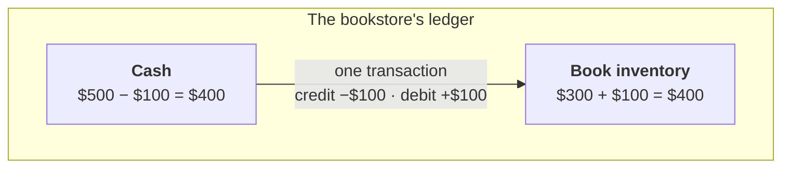
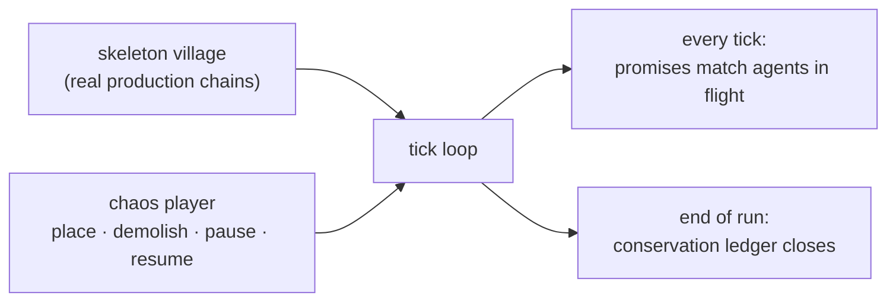

In an early build of Brews & Kings, you could demolish a house while its worker was out hauling grain. The delivery finished. The worker headed home. The home wasn't there. The engine shrugged and deleted them.

No error. No corpse. The town just got a little quieter.

That's the thing about resource bugs in a builder sim: nothing crashes. The game keeps running, slightly wrong, and twenty minutes later a playtester says "the brewery feels slow?" — and there's no stack trace for *the brewery feels slow*.

Every builder sim eventually dupes or leaks a resource, because everything is a chance for the books to drift:

- spawning and draining resources,
- buffers in buildings and agents in flight,
- every transmute, arrival, refund, and demolition.

---

## Double-entry bookkeeping in one minute

Accountants solved this in the 1400s.

The rule: **value is never created or destroyed — it only moves between accounts**. So every transaction is written down twice: once in the account the value leaves, once in the account it enters. The two entries cancel out.

Say a bookstore buys $100 of books from a supplier. One transaction, two entries:

Before: $500 + $300 = $800. After: $400 + $400 = $800. The total never changes — money just moved.

Now swap money for logs, grain, and beer. In my engine the accounts are:

- every building's buffer (logs stacked at the sawmill),
- every agent in flight (a courier carrying grain *is* an account — value in transit),
- plus two derived columns per building, `reserved` and `pending`: promises about deliveries that haven't landed yet.

A brewery ordering grain debits the field's `reserved` and its own `pending`. The courier arriving cancels both and moves the actual grain. At any tick, the promises must exactly match the agents in flight, and the totals must balance.

That's the invariant. The rest of this post is about how I enforce it.

---

## The fuzzer

In [part 2](/blog/making-simulation-game-part-2-architecture/) I said the engine doesn't know what beer is. That has a nice side effect: the engine runs headless. No renderer, no player, no view layer — just ticks.

So I pointed a fuzzer at it:

1. **A skeleton village.** Scripted setups built from the real production chains — forest → woodcutter camp, grain field → farm, well → brewery → town. The biggest one tiles the whole economy across the map.
2. **A chaos player.** A random command generator layered on top. Every fifty-ish ticks it does something a messy player might do: place a random building, demolish one (courier mid-route? too bad), pause a building, resume it.
3. **An auditor.** Two levels of checks:
    - **Every tick:** no account goes negative; every `reserved`/`pending` promise traces back to a real agent in flight; no building holds a reference to a demolished building.
    - **End of run:** the full conservation ledger, per resource: Δ(stock + in-flight) = produced − consumed − delivered − construction − lost. Off by a single unit and the run fails, dumping the command log.

Two design details do most of the work:

- **The chaos player only makes legal moves.** It peeks at the state first and never emits a command the game would reject. I'm fuzzing the bookkeeping, not the input validation.
- **Its dice are separate from the sim's dice, and seeded.** Chaos is layered on top of a deterministic engine, so any failure replays exactly, tick for tick. A fuzz failure isn't a shrug — it's a repro.

### What it caught

- **The pause button did nothing.** Pause and resume commands fired a signal and mutated no state. Found before the fuzzer even ran — just from writing down what it should press.
- **Demolition left dangling references.** Destroy a building while its courier is mid-route, and the courier keeps pointing at a building that no longer exists.
- **The vanishing worker** from the intro. The refund path for a homeless worker had nowhere to send them, so it dropped them on the floor. The ledger expected 0 and got −1.
- **Two logs leaked.** The wood ledger expected −1 and closed at −3 — two units of wood genuinely lost down a town-order path that no hand-written test had ever exercised.

Each of these had survived the unit tests, because unit tests check scenarios I could imagine. The fuzzer's job is the scenarios I can't.

### The auditor had bugs too

Here's the part I didn't expect: the first imbalances weren't engine bugs. They were holes in the auditor.

Grain fields regrow by writing directly into their own buffer — no production event. The meter never saw the grain appear, so it cried *dupe!* over honest farming. Workers riding along on return deliveries weren't counted as in flight, so they read as *leaked*.

Same lesson every time: **double-entry only works if every mutation goes through a path the books can see.** A silent write is indistinguishable from a bug, even when the state ends up correct.

Which led to the real fix. Some losses are legitimate — demolish a house with workers inside and they're gone, that's the game. But the engine is no longer allowed to drop a resource silently: every lossy path now emits a `resource_lost` event, and the ledger has a `lost` column.

Losses are fine. Unbooked losses are not.

---

## Wrap-up

A builder sim is an economy. Treat it like one, and a 600-year-old accounting trick becomes a debugger: bugs no playtester could describe — *the brewery feels slow?* — turn into a failing assert with a tick number, a resource name, and a seed that replays the whole crime.

---

## Brews & Kings

This engine powers **Brews & Kings**, a roguelike medieval city builder where your whole city feeds one sprawling brewing operation — and kings rise or fall on the strength of your beer. Wishlist it on Steam to follow along.

<iframe src="https://store.steampowered.com/widget/4845040/" frameborder="0" width="646" height="190"></iframe>
